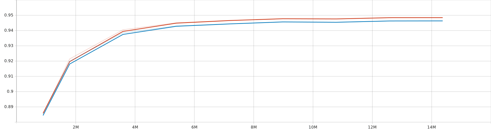
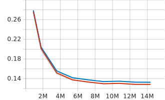

[Japanese/[English](README_EN.md)]
# 数独を畳み込みニューラルネットワークで解く

## 概要

数独（Sudoku）は、9x9の正方形の枠内に1から9までの数字を埋めるパズルゲームです。ただし、同じ数字が行と列の中で重複しないように配置する必要があります。このプロジェクトは、畳み込みニューラルネットワークを使用して数独を解くことに焦点を当てています。

## 問題設定

このタスクは、k次元分類で、モデルは9x9の行列内の各位置にクラスを割り当てる必要があります。クラスは0から8までの数字で、数独の数字は1から9ですが、コンピュータで扱う数字は通常0から始まります。このタスクは、セグメンテーションのように、画像全体の上にピクセルごとにクラスを割り当てるタスクです。

## 必要なライブラリ

- pytorch==2.0.1
- pytorch-cuda==11.8
- numpy==1.25.2

## ファイルの説明
- `dsets.py`：データセットを作るモジュール。
- `training.py`：トレーニング用です。マインファイルである。
- `models.py`: 全部のモデルは含まれている。

## トレーニング
dsets.pyのパスを変えて、自分が持てるデータセットを決定する。その後tensorboardのコメントを自分の好みに変わって。ターミナルで python -m training.py を実行すると学習が始まります。

## データ処理

このデータセットはKaggleから取得し、100万の数独ゲームが含まれています。データ処理において、Numpyからテンソルに変換する方法が採用されました。また、畳み込み層を使用する場合、入力データが[-1, -1]になるように学習しやすいように正規化されています。

# 学習ループ

このプロジェクトの主要なファイルには、すべてのプログラムがクラスとして含まれています。関数として設計されていることが重要で、変更が必要な場合に便利です。主要な関数は学習ループを実行し、その中でもっとも重要な部分は`computeBatchLoss`関数です。

## 損失関数

このプロジェクトで使用した損失関数は、PyTorchで一般的に使用されるものです。`CrossEntropyLoss`はロジットを入力として受け取り、その後にSoftMax関数が適用され、最も高い確率を持つクラスが選択されます。この場合、左端の9はクラスの次元数を示しており、SoftMaxを適用すると、その次元から最高確率の次元が選択され、9次元から1つが選ばれます。

たとえば、左上の位置[0,0]の場合、その9つの次元を調べて、2番目の次元が最も高い確率を持つ場合、2番目の次元が1の数字を表すため、出力[0,0]の位置には1が表示されます。

## メトリクス

モデルの評価には、損失だけでなく他のメトリクスを使用することで、より深い理解が得られます。一般的に使用されるメトリクスには、正確度、適合率、再現率、F1スコアなどがあります。

残念ながら、メトリクスの測定方法は完璧ではないため、このモデルの精度は実際よりも高くなっています。数独は最初からすべての数字が分かっているわけではなく、最初から20以上の数字がわかっています。しかし、これらの数字も精度に影響を与えます。より正確な結果が必要な場合、最初にわかっている数字が精度の測定時に影響を与えないように注意する必要があります。

たとえば、モデルがすべての予測を誤った場合でも、81から20以上の数字は正しくなります。そのため、モデルのベースライン正確度はほぼ25%です。

## モデル

このプロジェクトの主な焦点は、畳み込みニューラルネットワークを使用して数独を解くことでした。畳み込みモデルにおいて、最も重要なのは最後の層で、すべてのモデルは最後にストライド1の畳み込み層を使用しています。この層により、出力は9x9x9次元になります。

このモデルには約1800万のパラメータが含まれており、パラメータ数と層数を段階的に増やすことで高い精度が達成されました。

## 結論

畳み込みニューラルネットワークを使用して数独を解くプロジェクトについての詳細情報は、このGitHubリポジトリ内で提供されています。畳み込み層を使用することで、数独の解決が可能になり、様々なデータ処理と学習手法についての情報も含まれています。

この三つのグラフは精度、F1scoreとloss、その順番であります。青いのラインは検証データ、赤いは学習データです。
### 精度

### F1 Score

### Loss

詳細については、プロジェクトのファイルとコードを参照してください。ご質問や提案がある場合は、気軽にお知らせください。

## Author
[fuwafuwamoemoekissaten](https://github.com/fuwafuwamoemoekissaten)

## References
https://github.com/Kyubyong/sudoku

https://www.kaggle.com/datasets/bryanpark/sudoku

Stevens, E., Antiga, L., Viehmann, T., & Chintala, S. (2020). Deep learning with pytorch: Build, train, and tune neural networks using python tools. Manning Publications.

## LICENSE
このプロジェクトはMITライセンスの下でライセンスされています。詳細については[LICENSE.md](LICENSE)ファイルを参照してください。
